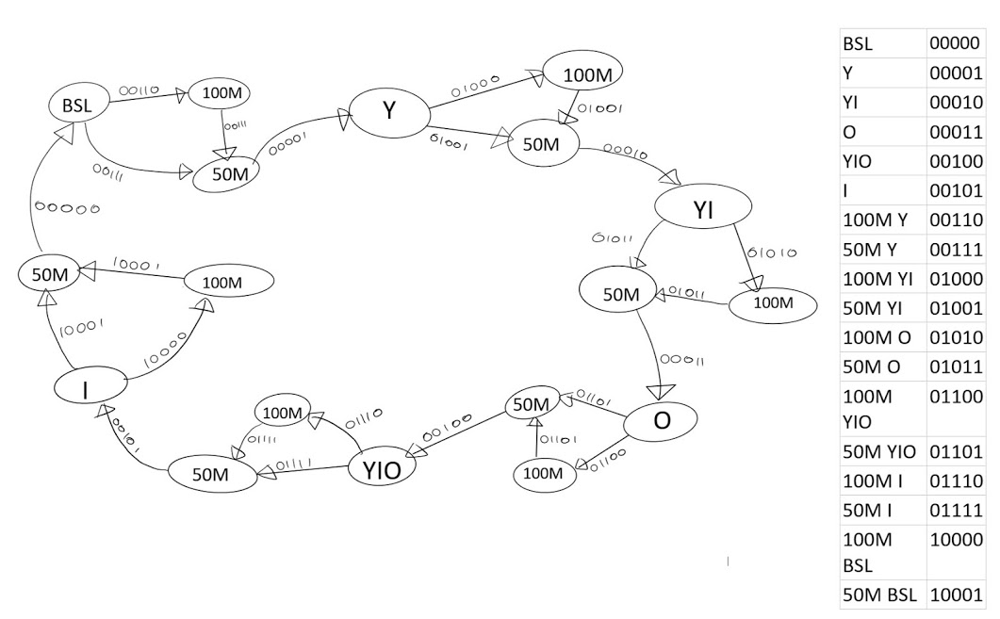

<h1>DONANIM TANIMLAMA DİLLERİ (VHDL)</h1>
<h3>Proje konusu: </h3>
<i>Durumlar arasında geçiş yapabilen bir sürücü modeli oluşturmak ve geçiş yaptığı durumları sinyal örneklemesiyle gerçeklemek </i>
<h3>Örnek MEALY durum geçiş diagramı:</h3>

